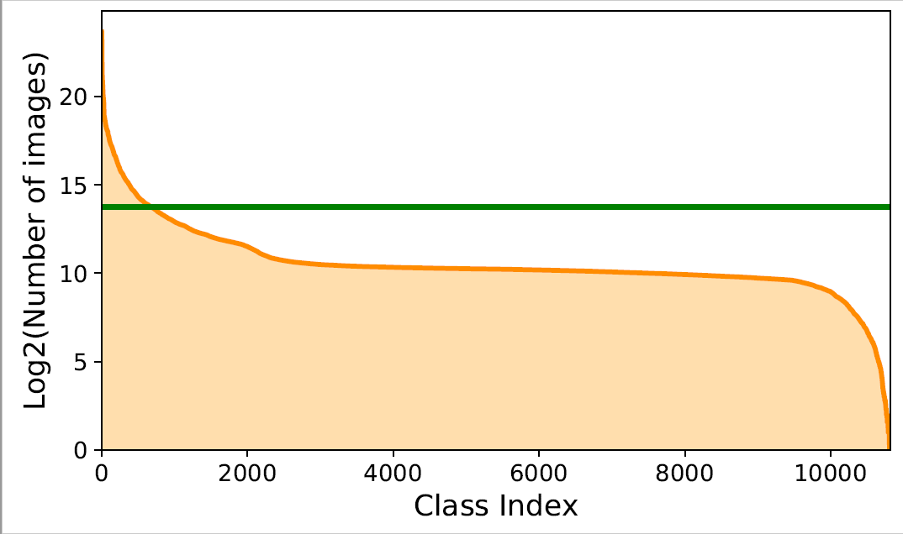
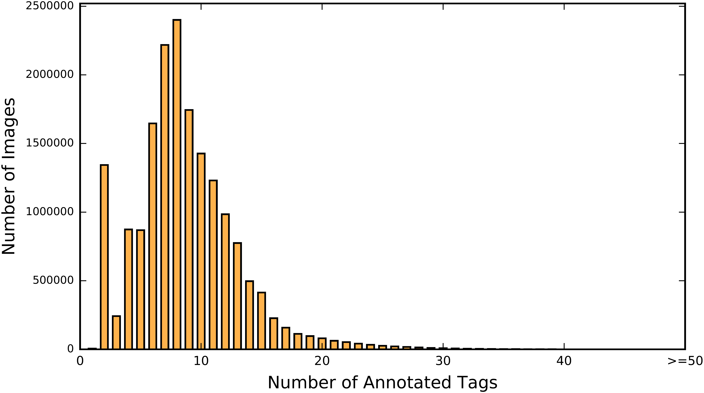

# Tencent ML-Images

This repository introduces the open-source project dubbed **Tencent ML-Images**, which publishes 
<!--- * **ML-Images**: the largest open-source multi-label image database, including 18,019,881 URLs to images, which are annotated with labels up to 11,166 categories-->
* **ML-Images**: the largest open-source multi-label image database, including 17,609,752 training and 88,739 validation image URLs, which are annotated with up to 11,166 categories
* **Resnet-101 model**: it is pre-trained on ML-Images, and achieves the top-1 accuracy 80.73% on ImageNet via transfer learning

## Updates

* [2019/12/26] Our manuscript of this open-source project has been accepted to IEEE Access ([Journal](https://ieeexplore.ieee.org/document/8918053/authors#authors), [ArXiv](https://arxiv.org/abs/1901.01703)). It presents more details of the database, the loss function, the training algorithm, and more experimental results. 
* [2018/12/19] We simplify the procedure of downloading images. Please see [Download Images](#download-images).
<!--- * [2018/12/22] We release one ArXiv manuscript at XXX, to demonstrate the details of our database, the loss function and training algorithm, as well as results.  --->


# Contents

* [Dependencies](#dependencies)

* [Data](#data)
  * [Image Source](#image-source)
  * [Download Images](#download-images)
    * [Download Images from ImageNet](#download-images-from-imagenet)
    * [Download Images from Open Images](#download-images-from-open-images)
  * [Semantic Hierarchy](#semantic-hierarchy)
  * [Annotations](#annotations)
  * [Statistics](#statistics)
  
* [Train](#train)
  * [Prepare the TFRecord File](#prepare-the-tfrecord-file)
  * [Pretrain on ML-Images](#pretrain-on-ml-images)
  * [Finetune on ImageNet](#finetune-on-imagenet)
  * [Checkpoints](#checkpoints)
  * [Single-Label Image Classification](#single-label-image-classification)
  * [Feature Extraction](#feature-extraction)
 

* [Results](#results)

* [Copyright](#copyright)

* [Citation](#citation)


# [Dependencies](#dependencies)
  * Linux
  * [Python 2.7](https://www.python.org/)
  * [Tensorflow >= 1.6.0](https://www.tensorflow.org/install/)

# [Data](#data)
[[back to top](#)]

### [Image Source](#image-source)
[[back to top](#)]


The image URLs of ML-Images are collected from [ImageNet](http://www.image-net.org/) and [Open Images](https://github.com/openimages/dataset). 
Specifically,  
* Part 1: From the whole database of ImageNet, we adopt 10,706,941 training and 50,000 validation image URLs, covering 10,032 categories.
* Part 2: From Open Images, we adopt 6,902,811 training and 38,739 validation image URLs, covering 1,134 unique categories (note that some other categories are merged with their synonymous categories from ImageNet). 

Finally, ML-Images includes 17,609,752 training and 88,739 validation image URLs, covering 11,166 categories. 

<!---
The image URLs of ML-Images are collected from [ImageNet](http://www.image-net.org/) and [Open Images](https://github.com/openimages/dataset). 
Specifically, 
* Part 1: we adopt the set [ImageNet-11k](http://data.mxnet.io/models/imagenet-11k/). It is a subset of ImageNet, collected by [MXNet](http://mxnet.incubator.apache.org/). It includes 1,474,703 images and 11,221 categories. However, we find there are many abstract categories in visual domain, such as "event", "summer", etc. We think that the training images annotated with such abstract categories 
will not help (even harm) the visual representation learning. Thus, we abandon these categories. 
* Part 2: We filter the URLs of Open Images via a per-class criteria. Firstly, if one class occurs in less than 650 URLs, then it is removed. Besides, we also 1) remove some abstract categories as did above, and 2) merge some redundant categories with those in ImageNet. Then, if all annotated tags of one URL are removed, then this URL is abandoned. Consequently,  6,902,811 training URLs and 159,424 validation URLs are remained, covering 1,134 unique categories.
--->
<!---
We then merge URLs from above two parts according to their categories. Specifically, we firstly all categories to their unique WordIDs defined in [WordNet](https://wordnet.princeton.edu/). According to the semantic topological structure of WordIDs, if two categories share the same WordID or are synonymous, then they are merged to a unique category, as well as their URLs. 
Finally, the number of remained URLs is 17,659,752, and the number of categories is 11,166. 
--->

<!---
Consequently,  8,385,050 training URLs and 159,424 validation URLs are remained, covering 2,039 categories.
--->

### [Download Images](#download-images)
[[back to top](#)]

Due to the copyright, we cannot provide the original images directly. However, one can obtain all images of our database using the following files:
* train_image_id_from_imagenet.txt ([Link1](https://drive.google.com/file/d/1-7x4wPa764MJkjhhNj0PWPhgwMJOXziA/view?usp=sharing), [Link2](https://pan.baidu.com/s/1oUfIMCHj1wyz0ywuSn1iEQ))
* val_image_id_from_imagenet.txt ([Link1](https://drive.google.com/file/d/1-1x1vJFZGesz-5R2W8DLWHaVEbIPjuJs/view?usp=sharing), [Link2](https://pan.baidu.com/s/10prwZcHstYA8ppyXxbEbXA))
* train_urls_from_openimages.txt ([Link1](https://drive.google.com/file/d/1__HFVimF5yUwlyEjaUoSmBBfRQKJTYKW/view?usp=sharing), [Link2]( https://pan.baidu.com/s/1jjkaLu5JiHV6D0qyWXSxMA ))
* val_urls_from_openimages.txt ([Link1](https://drive.google.com/file/d/1JkTcEEkB1zYI6NtAM-vXpsv7uDZ3glEz/view?usp=sharing), [Link2](https://pan.baidu.com/s/1F8mk58IGj9BP0-HSF-M9aw))

<!--- ##### Download images from ImageNet --->

#### [Download Images from ImageNet](#download-images-from-imagenet)
We find that massive urls provided by ImageNet have expired (please check the file `List of all image URLs of Fall 2011 Release` at http://image-net.org/download-imageurls). Thus, here we provide the original image IDs of ImageNet used in our database. One can obtain the training/validation images of our database through the following steps:
* Download the whole database of [ImageNet](http://image-net.org/download-images)
* Extract the training/validation images using the image IDs in `train_image_id_from_imagenet.txt` and `val_image_id_from_imagenet.txt`

The format of `train_image_id_from_imagenet.txt` is as follows:
```
...
n04310904/n04310904_8388.JPEG   2367:1  2172:1  1831:1  1054:1  1041:1  865:1   2:1
n11753700/n11753700_1897.JPEG   5725:1  5619:1  5191:1  5181:1  5173:1  5170:1  1042:1  865:1   2:1
...
```
As shown above, one image corresponds to one row. The first term is the original image ID of ImageNet. The followed terms separated by space are the annotations. For example, "2367:1" indicates class 2367 and its confidence 1. Note that the class index starts from 0, and you can find the class name from the file [data/dictionary_and_semantic_hierarchy.txt](data/dictionary_and_semantic_hierarchy.txt).

**NOTE**: We find that there are some repeated URLs in `List of all image URLs of Fall 2011 Release` of ImageNet, i.e., the image corresponding to one URL may be stored in multiple sub-folders with different image IDs. We manually check a few repeated images, and find the reason is that one image annotated with a child class may also be annotated with its parent class, then it is saved to two sub-folders with different image IDs. To the best of our knowledge, this point has never been claimed in ImageNet or any other place. If one want to use ImageNet, this point should be noticed. 
Due to that, there are also a few repeated images in our database, but our training is not significantly influenced. In future, we will update the database by removing the repeated images. 


#### [Download Images from Open Images](#download-images-from-open-images)

<!---
* train_urls.txt ([link1](https://drive.google.com/open?id=1ExY0GpRWxGzDHAI-p44m-B0AB76NeLy7), [link2](https://pan.baidu.com/s/1cx6n6CYNqegKVq1O2YVCJg))
* val_urls.txt ([link1](https://drive.google.com/open?id=13SSar872e73UcshIW7IGbmvUGcFjHyxg), [link2](https://pan.baidu.com/s/1BfipStD2PY7MAMRoZa9ecg))
--->

The images from Open Images can be downloaded using URLs. 
The format of `train_urls_from_openimages.txt` is as follows:
```
...
https://c4.staticflickr.com/8/7239/6997334729_e5fb3938b1_o.jpg  3:1  5193:0.9  5851:0.9 9413:1 9416:1
https://c2.staticflickr.com/4/3035/3033882900_a9a4263c55_o.jpg  1053:0.8  1193:0.8  1379:0.8
...
```
As shown above, one image corresponds to one row. The first term is the image URL. The followed terms separated by space are the annotations. For example, "5193:0.9" indicates class 5193 and its confidence 0.9. 

##### Download Images using URLs
We also provide the code to download images using URLs. 
As `train_urls_from_openimages.txt` is very large, here we provide a tiny file [train_urls_tiny.txt](data/train_urls_tiny.txt) to demonstrate the downloading procedure.
```
cd data
./download_urls_multithreading.sh
```
A sub-folder `data/images` will be generated to save the downloaded jpeg images, as well as a file `train_im_list_tiny.txt` to save the image list and the corresponding annotations. 


### [Semantic Hierarchy](#semantic-hierarchy)
[[back to top](#)]

We build the semantic hiearchy of 11,166 categories, according to [WordNet](https://wordnet.princeton.edu/). 
The direct parent categories of each class can be found from the file [data/dictionary_and_semantic_hierarchy.txt](data/dictionary_and_semantic_hierarchy.txt). The whole semantic hierarchy includes 4 independent trees, of which 
the root nodes are `thing`, `matter`, `object, physical object` and `atmospheric phenomenon`, respectively. 
The length of the longest semantic path from root to leaf nodes is 16, and the average length is 7.47. 

### [Annotations](#annotations)
[[back to top](#)]

Since the image URLs of ML-Images are collected from ImageNet and Open Images, the annotations of ML-Images are constructed based on the 
original annotations from ImageNet and Open Images. Note that the original annotations from Open Images are licensed by Google Inc. under [CC BY-4.0](https://creativecommons.org/licenses/by/4.0/). Specifically, we conduct the following steps to construct the new annotations of ML-Images. 
* For the 6,902,811 training URLs from Open Images, we remove the annotated tags that are out of the remained 1,134 categories.
* According to the constructed [semantic hierarchy](data/dictionary_and_semantic_hierarchy.txt) of 11,166 categories, we augment the annotations of all URLs of ML-Images following the cateria that if one URL is annotated with category i, then all ancestor categories will also be annotated to this URL. 
* We train a ResNet-101 model based on the 6,902,811 training URLs from Open Images, with 1,134 outputs. Using this ResNet-101 model, we predict the tags from 1,134 categories for the 10,756,941 single-annotated image URLs from ImageNet. Consequently, we obtain a normalized co-occurrence matrix between 10,032 categories from ImageNet and 1,134 categories from Open Images. We can determine the strongly co-occurrenced pairs of categories. For example, category i and j are strongly co-occurrenced; then, if one image is annotated with category i, then category j should also be annotated. 

The annotations of all URLs in ML-Images are stored in `train_urls.txt` and `val_urls.txt`.

<!---
（有关Open Images的部分，因为Annotations是适用CC BY-4.0（https://creativecommons.org/licenses/by/4.0/），所以如果有修改的话，是需要注明的。 License文件我会提，但您们rearme最好也要写，可以参考：https://wiki.creativecommons.org/wiki/Best_practices_for_attribution#This_is_a_good_attribution_for_material_you_modified_slightly
因为License文件我只提说：以下的文件可能已被修改，但readme里面就可能要写更详细点，像上面那个链接里的范例）
--->

### [Statistics](#statistics)
[[back to top](#)]

The main statistics of ML-Images are summarized in ML-Images.
                             
                                                      
| # Train images  | # Validation images  | # Classes | # Trainable Classes | # Avg tags per image |  # Avg images per class |
| :-------------: |:--------------------:| :--------:| :-----------------: |:-------------------:|  :---------------------:|
| 17,609,752       | 88,739          | 11,166    | 10,505              |  8.72    |  13,843 |

Note: *Trainable class* indicates the class that has over 100 train images.

<br/>
 
The number of images per class and the histogram of the number of annotations in training set are shown in the following figures.       

        


# [Train](#train)
[[back to top](#)]


<!---
### [Download Images using URLs](#download-images-using-urls)
[[back to top](#)]
--->

<!---
The full `train_urls.txt` is very large. 
Here we provide a tiny file [train_urls_tiny.txt](data/train_urls_tiny.txt) to demonstrate the downloading procedure.
```
cd data
./download_urls_multithreading.sh
```
A sub-folder `data/images` will be generated to save the downloaded jpeg images, as well as a file `train_im_list_tiny.txt` to save the image list and the corresponding annotations. 
--->

<!---
**Note**：Some URLs in [train_url.txt](https://pan.baidu.com/s/1cx6n6CYNqegKVq1O2YVCJg) have expired or may expire in future. If that, please provide us the missing URLs, we could provide the corresponding tfrecords.
--->

<!---
#### [How to handle invalid URLs during downloading?](#How-to-handle-invalid-URLs-during-downloading)
##### For URLs from ImageNet
The first 10,706,941 rows of `train_urls.txt` and the first 50,000 rows of `val_urls.txt` are URLs from ImageNet. 
A large proportion of these URLs have expired. However, the ImageNet website could provide the original images (see http://image-net.org/download), as well as the corresponse between each image ID and its original URL. Thus, we provide two novel files, that tell the image ID of each URL used in our database, including 
`train_urls_and_index_from_imagenet.txt` and `val_urls_and_index_from_imagenet.txt`. 
* train_urls_and_index_from_imagenet.txt ([link1](https://drive.google.com/open?id=1iK5j1zJ7SkitQ3ZIblYbUalAr5nFlngj), [link2](https://pan.baidu.com/s/145sGwH8Tv3RVwXZ95DuN4w)) 
* val_urls_and_index_from_imagenet.txt ([link1](https://drive.google.com/open?id=1ojVU0TIA3n9ytOW8p94IWbGD8QfXAfNj), [link2](https://pan.baidu.com/s/1p5sQrMUbfxiG94OjHj9-mQ))
--->
<!---
The format is as follows
```
...
n03874293_7679  http://image24.webshots.com/24/5/62/52/2807562520031003846EfpYGc_fs.jpg 2964:1  2944:1  2913:1  2896:1  2577:1  1833:1  1054:1  1041:1  865:1   2:1
n03580845_3376  http://i02.c.aliimg.com/img/offer/22/85/63/27/9/228563279   3618:1  3604:1  1835:1  1054:1  1041:1  865:1   2:1
...
```
In each row, the first term is the image ID in ImageNet, while other terms are the corresponding URL and annotations. 
Then, two steps should be done to obtain the images used in ML-Images: 
* Download the original images of the whole database of ImageNet from (http://image-net.org/download), and the corresponding URL file is `List of all image URLs of Fall 2011 Release` (see http://image-net.org/download-imageurls)
* Pick out the images used in ML-Images, accoording to `train_urls_and_index_from_imagenet.txt` and `val_urls_and_index_from_imagenet.txt`.
--->

<!---
##### For URLs from Open Images
The last 6,902,811 rows of `train_urls.txt` and the last 38,739  rows of `val_urls.txt` are URLs from Open Images. 
Most of these URLs are valid, and you can directly download the images using the provided `download_urls_multithreading.sh`. 
--->


### [Prepare the TFRecord File](#prepare-tfrecord)
[[back to top](#)]

Here we generate the tfrecords using the multithreading module. One should firstly split the file `train_im_list_tiny.txt` into multiple smaller files, and save them into the sub-folder `data/image_lists/`. 
```
cd data
./tfrecord.sh
```
Multiple tfrecords (named like `x.tfrecords`) will saved to `data/tfrecords/`.

### [Pretrain on ML-Images](#pretrain-on-ml-images)
[[back to top](#)]

Before training, one should move the train and validation tfrecords to `data/ml-images/train` and `data/ml-images/val`, respectively. 
Then, 
```
./example/train.sh
```
**Note**: Here we only provide the training code in the single node single GPU framework, while our actual training on ML-Images is based on an internal distributed training framework (not released yet). One could modify the training code to the distributed framework following [distributed tensorFlow](https://www.tensorflow.org/deploy/distributed). 

### [Finetune on ImageNet](#finetune-on-imagenet)
[[back to top](#)]

One should firstly download the ImageNet (ILSVRC2012) database, then prepare the tfrecord file using [tfrecord.sh](example/tfrecord.sh). 
Then, you can finetune the ResNet-101 model on ImageNet as follows, with the checkpoint pre-trained on ML-Images.
```
./example/finetune.sh
```

### [Checkpoints](#checkpoints)
[[back to top](#)]

* ckpt-resnet101-mlimages ([link1](https://drive.google.com/open?id=1FKkw2HD0jrCJKOM_kpyOvZ_m_YPA9tdV), [link2](https://pan.baidu.com/s/1166673BNWuIeWxD7lf6RNA)): pretrained on ML-Images
* ckpt-resnet101-mlimages-imagenet ([link1](https://drive.google.com/open?id=1wIhRemoPxTw7uDz-TlwfYJsOR2usb2kg), [link2](https://pan.baidu.com/s/1UE7gavcVznYVA5NZ-GFAvg)): pretrained on ML-Images and finetuned on ImageNet (ILSVRC2012)

Please download above two checkpoints and move them into the folder `checkpoints/`, if you want to extract features using them.

### [Single-Label Image Classification](#single-label-image-classification)

Here we provide a demo for single-label image-classification, using the checkpoint `ckpt-resnet101-mlimages-imagenet` downloaded above. 
```
./example/image_classification.sh
```
The prediction will be saved to `label_pred.txt`. If one wants to recognize other images, `data/im_list_for_classification.txt` should be modified to include the path of these images. 

### [Feature Extraction](#feature-extraction)
[[back to top](#)]

```
./example/extract_feature.sh
```


# [Results](#results)
[[back to top](#)]

The retults of different ResNet-101 checkpoints on the validation set of ImageNet (ILSVRC2012) are summarized in the following table. 


| Checkpoints | Train and finetune setting  | <sub> Top-1 acc<br>on Val 224 </sub> | <sub> Top-5 acc<br>on Val 224 </sub> | <sub> Top-1 acc<br>on Val 299 </sub> | <sub> Top-5 acc<br>on Val 299 </sub> |
 :------------- |:--------------------| :--------:| :-----------------: |:------------------:| :-------------------:| 
 <sub> [MSRA ResNet-101](https://github.com/KaimingHe/deep-residual-networks) </sub> |  <sub> train on ImageNet </sub> | 76.4    |  92.9              |   --       |   --  | 
 <sub> [Google ResNet-101  ckpt1](https://arxiv.org/abs/1707.02968) </sub> |  <sub> train on ImageNet, 299 x 299 </sub> |  --  |  --  | 77.5  | 93.9 |
 <sub> Our ResNet-101 ckpt1 </sub> |  <sub> train on ImageNet </sub> | 77.8 | 93.9 | 79.0 | 94.5 |
 <sub> [Google ResNet-101  ckpt2](https://arxiv.org/abs/1707.02968) </sub> | <sub> Pretrain on JFT-300M, finetune on ImageNet, 299 x 299 </sub> |  --  |  --  | 79.2  | 94.7 |
 <sub> Our ResNet-101 ckpt2 </sub> | <sub> Pretrain on ML-Images, finetune on ImageNet </sub> | **78.8** | **94.5** | 79.5 | 94.9 |
 <sub> Our ResNet-101 ckpt3 </sub> | <sub> Pretrain on ML-Images, finetune on ImageNet 224 to 299 </sub> | 78.3 | 94.2 | **80.73** | **95.5** | 
 <sub> Our ResNet-101 ckpt4 </sub> | <sub> Pretrain on ML-Images, finetune on ImageNet 299 x 299 </sub> | 75.8 | 92.7 | 79.6 | 94.6 | 

Note: 
* if not specified, the image size in training/finetuning is 224 x 224. 
* *finetune on ImageNet from 224 to 299* means that the image size in early epochs of finetuning is 224 x 224, then 299 x 299 in late epochs.
* *Top-1 acc on Val 224* indicates the top-1 accuracy on 224 x 224 validation images.


# [Copyright](#copyright)
[[back to top](#)]

The annotations of images are licensed by Tencent under [CC BY 4.0](https://creativecommons.org/licenses/by/4.0/) license. 
The contents of this repository, including the codes, documents and checkpoints, are released under an [BSD 3-Clause](https://opensource.org/licenses/BSD-3-Clause) license. Please refer to [LICENSE](LICENSE) for more details.

If there is any concern about the copyright of any image used in this project, please [email us](mailto:wubaoyuan1987@gmail.com).

# [Citation](#citation)
[[back to top](#)]

If any content of this project is utilized in your work (such as data, checkpoint, code, or the proposed loss or training algorithm), please cite the following manuscript.
```
@article{tencent-ml-images-2019,
  title={Tencent ML-Images: A Large-Scale Multi-Label Image Database for Visual Representation Learning},
  author={Wu, Baoyuan and Chen, Weidong and Fan, Yanbo and Zhang, Yong and Hou, Jinlong and Liu, Jie and Zhang, Tong},
  journal={IEEE Access},
  volume={7},
  year={2019}
}
```


