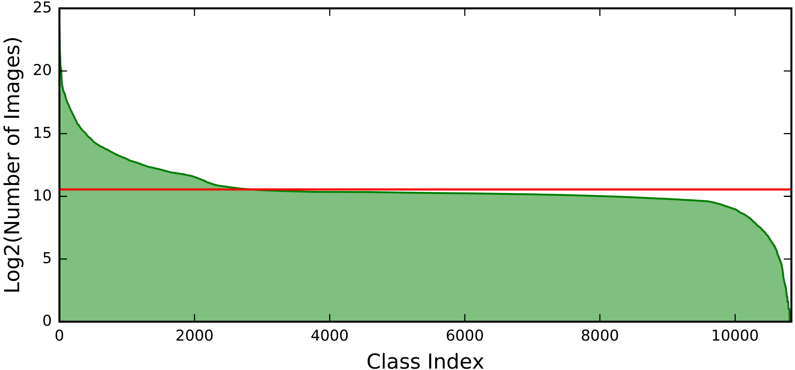
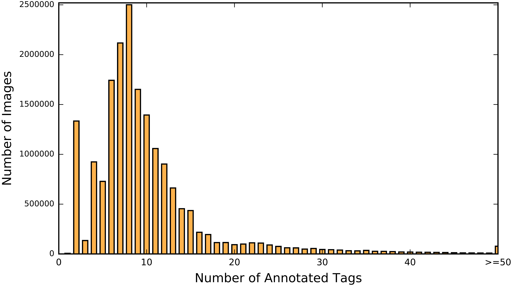

# Tencent ML-Images

This repository introduces the open-source project dubbed **Tencent ML-Images**, which publishes 
* **ML-Images**: the largest open-source multi-label image database, including 18,019,881 million URLs to images, which are annotated with labels up to 11,166 categories
* **Resnet-101 model**: it is pre-trained on ML-Images, and achieves the highest top-1 accuracy 80.73% on ImageNet via transfer learning


## News

af ge 

zsf g 

<!---
# Contents

* [Dependencies](#dependencies)

* [Data](#data)
  * [Download](#download)
    * URLs
    * Dictionary and Annotations
  * [Source](#)
  * [Semantic hierarchy](#)
  * [Annotations](#)
  * [Statistics](#)
  
* [Train](#)
  * [Download images using URLs](#)
  * [Prepare the TFRecord file](#)
  * [Pretrain on ML-Images](#)
  * [Finetune on ImageNet](#)
  * [Feature extraction](#)
    * xdg g
    
* [Checkpoints](#)
  * ML-Images checkpoint
  * ImageNet checkpoint

* [Copyright](#)
* [Citations](#)
-->

# Dependencies
  * Linux
  * [Python 2.7](https://www.python.org/)
  * [Tensorflow v1.2.1](https://www.tensorflow.org/install/)

# Data
[[back to top](#)]

### Download
[[back to top](#)]

The image URLs of are 

### Image source
[[back to top](#)]

The image URLs of ML-Images are collected from [ImageNet](http://www.image-net.org/) and [Open Images](https://github.com/openimages/dataset). 
Specifically, 
* Part 1: we adopt the set [ImageNet-11k](http://data.mxnet.io/models/imagenet-11k/). It is a subset of ImageNet, collected by [MXNet](http://mxnet.incubator.apache.org/). It includes 1,474,703 images and 11,221 categories.
* Part 2: We filter the URLs of Open Images via a per-class criteria. Firstly, if one class occurs in less than 650 URLs, then it is removed. Then, if all annotated tags of one URL are removed, then this URL is abandoned. Consequently,  8,385,050 training URLs and 159,424 validation URLs are remained, covering 2,039 categories.

We then merge URLs from above two parts according to their categories. Specifically, we firstly all categories to their unique WordIDs defined in [WordNet](https://wordnet.princeton.edu/). According to the semantic topological structure of WordIDs, if two categories share the same WordID or are synonymous, then they are merged to a unique category, as well as their URLs. 

Finally, the number of remained URLs is 18,019,881, and the number of categories is 11,166. 


### Semantic hierarchy
[[back to top](#)]

### Annotations
[[back to top](#)]

（有关Open Images的部分，因为Annotations是适用CC BY-4.0（https://creativecommons.org/licenses/by/4.0/），所以如果有修改的话，是需要注明的。 License文件我会提，但您们rearme最好也要写，可以参考：https://wiki.creativecommons.org/wiki/Best_practices_for_attribution#This_is_a_good_attribution_for_material_you_modified_slightly
因为License文件我只提说：以下的文件可能已被修改，但readme里面就可能要写更详细点，像上面那个链接里的范例）

### Statistics
[[back to top](#)]

The main statistics of ML-Images are summarized in ML-Images.

                                                      
                                                      
| # Train images  | # Validation images  | # Classes | # Trainable Classes | # Trainable Images | # Avg tags per image |  # Avg images per class |
| :-------------: |:--------------------:| :--------:| :-----------------: |:------------------:| :-------------------:|  :---------------------:|
| 18,019,881      | 500,000              | 11,166    | 10,505              | 18,018,621         |  9    |  1500 |

Note: *Trainable class* indicates the class that has over 100 train images.

<br/>
 
The number of images per class  and the number of tags per image in training set  are shown in the following figures.                    
<!---
  
-->

# Train
[[back to top](#)]

### Download images using URLs
[[back to top](#)]

```
dggd
```

### Prepare the TFRecord file
[[back to top](#)]

### Pretrain on ML-Images
[[back to top](#)]

### Finetune on ImageNet
[[back to top](#)]

```
python finetune.py
```

### Results

The retults of different ResNet-101 checkpoints on the validation set of ImageNet are summarized in the following table. 


| Checkpoints | Train and finetune setting  | <sub> Top-1 acc<br>on Val 224 </sub> | <sub> Top-5 acc<br>on Val 224 </sub> | <sub> Top-1 acc<br>on Val 299 </sub> | <sub> Top-5 accuracy<br>on Val 299 </sub> |
 :------------- |:--------------------| :--------:| :-----------------: |:------------------:| :-------------------:| 
 <sub> Our ResNet-101 ckpt4 </sub> | <sub> Pretrain on ML-Images, finetune on ImageNet 299 x 299 </sub> | 75.8 | 92.7 | 79.6 | 94.6 | 
 <sub> [MSRA ResNet-101](https://github.com/KaimingHe/deep-residual-networks) </sub> | train on ImageNet  | 76.4    |  92.9              |   --       |   --  | 
 <sub> [Google ResNet-101  ckpt1](https://arxiv.org/abs/1707.02968) </sub> | train on ImageNet, 299 x 299 |  --  |  --  | 77.5  | 93.9 |
 <sub> Our ResNet-101 ckpt1 </sub> | train on ImageNet | 77.8 | 93.9 | 79.0 | 94.5 |
 <sub> [Google ResNet-101  ckpt2](https://arxiv.org/abs/1707.02968) </sub> | <sub> Pretrain on JFT-300M, finetune on ImageNet, 299 x 299 </sub> |  --  |  --  | 79.2  | 94.7 |
 <sub> Our ResNet-101 ckpt2 </sub> | <sub> Pretrain on ML-Images, finetune on ImageNet </sub> | **78.8** | **94.5** | 79.5 | 94.9 |
 <sub> Our ResNet-101 ckpt3 </sub> | <sub> Pretrain on ML-Images, finetune on ImageNet 224 to 299 </sub> | 78.3 | 94.2 | **80.73** | **95.5** | 
 <sub> Our ResNet-101 ckpt4 </sub> | <sub> Pretrain on ML-Images, finetune on ImageNet 299 x 299 </sub> | 75.8 | 92.7 | 79.6 | 94.6 | 

Note: 
* if not specified, the image size in training/finetuning is 224 x 224. 
* *finetune on ImageNet from 224 to 299* means that the image size in early epochs of finetuning is 224 x 224, then 299 x 299 in late epochs.
* *Top-1 acc on Val 224* indicates the top-1 accuracy on 224 x 224 validation images.


 

### Feature extraction
[[back to top](#)]

```
python example/extract_features.py
```


# Checkpoints
[[back to top](#)]

* ResNet-101 Checkpoint pretrained on ML-Images: [ckpt-resnet101-mlimages](# url)
* ResNet-101 Checkpoint finetuned on ImageNet: [ckpt-resnet101-imagenet](# url)


# Copyright 
[[back to top](#)]

The annotations of images are licensed by Tencent under [CC BY 4.0](https://creativecommons.org/licenses/by/4.0/) license. 
The contents of this repository, including the codes, documents and checkpoints, are released under an [BSD 3-Clause](https://opensource.org/licenses/BSD-3-Clause) license.


# Citation
[[back to top](#)]

